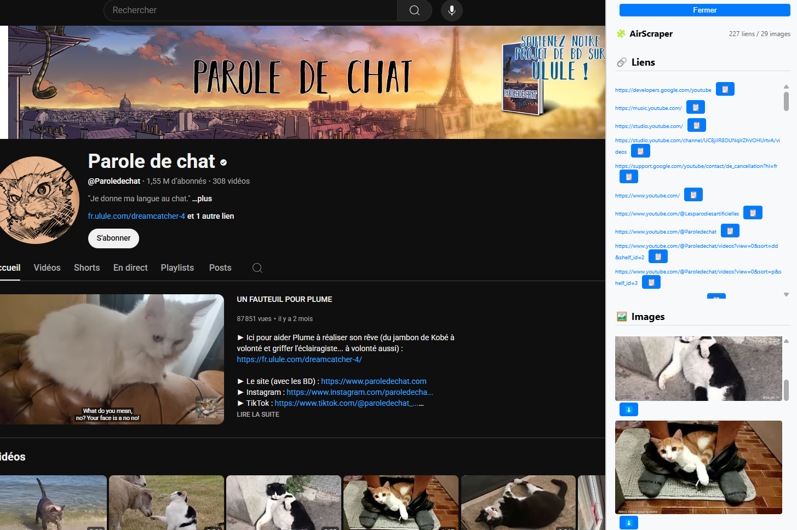

# 📑 AirScraper — Chrome Extension

Une extension Chrome ✨ ultra-légère ✨ qui scanne la page web en cours et affiche tous les **liens** et **images** dans une sidebar interactive, avec options de **copie** et **téléchargement**.

---

## 🚀 Fonctionnalités

- 🔗 **Liste tous les liens** de la page
  - Copier individuellement en un clic
- 🖼️ **Affiche toutes les images**
  - Téléchargement direct en 1 clic
- 🎨 **Interface propre et responsive**
- 🧭 **Sidebar masquable** avec bouton de réouverture flottant
- ⚡ Zéro dépendance, injecté dynamiquement

---

## 📸 Aperçu

| Sidebar ouverte | Sidebar repliée |
|-----------------|-----------------|
|  |  |

---

## 🛠️ Installation manuelle

1. Clone ce repo ou télécharge-le en `.zip`
2. Va sur `chrome://extensions/`
3. Active le **Mode développeur**
4. Clique sur **Charger l’extension non empaquetée**
5. Sélectionne le dossier

---

## 🧠 Structure du projet

```markdown
📁 air-scraper/
├── content.js # Injection et logique principale
├── background.js # Téléchargement sécurisé via service worker
├── manifest.json # Déclaration de l'extension (V3)
├── sidebar-body.html # Structure HTML de la sidebar
├── sidebar.css # Style moderne de la sidebar
```


---

## ✨ Personnalisation

- Tu peux modifier `sidebar.css` pour adapter les couleurs ou animations.
- Le bouton 📑 est personnalisable (position, couleur, emoji).
- Le script est facilement extensible (ex: ajout de filtres, recherche, tri…).

---

## 🔒 Permissions

| Permission       | Raison                                     |
|------------------|--------------------------------------------|
| `activeTab`      | Injecter le code dans la page              |
| `downloads`      | Télécharger les images                     |
| `clipboardWrite` | Copier les liens dans le presse-papiers    |

---

## 💡 Idées futures

- [ ] Ajout de filtres (type de lien, domaine…)
- [ ] Mode dark automatique
- [ ] Compteur + tri des images par taille

---

## 🧑‍💻 Auteur

Développé avec ❤️ par Clément Nuttens

> Inspiré par le film *The Social Network*, mais sans scraper Facebook 😅

